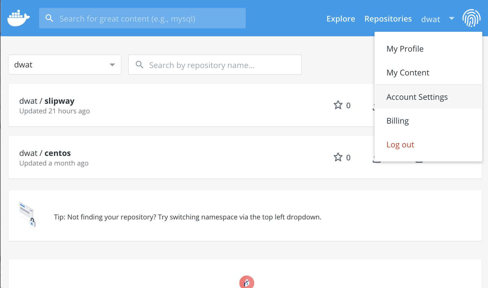
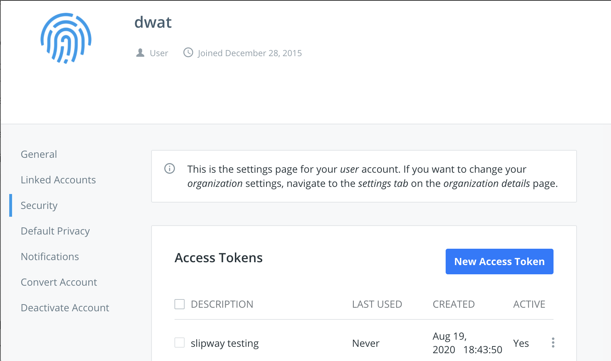
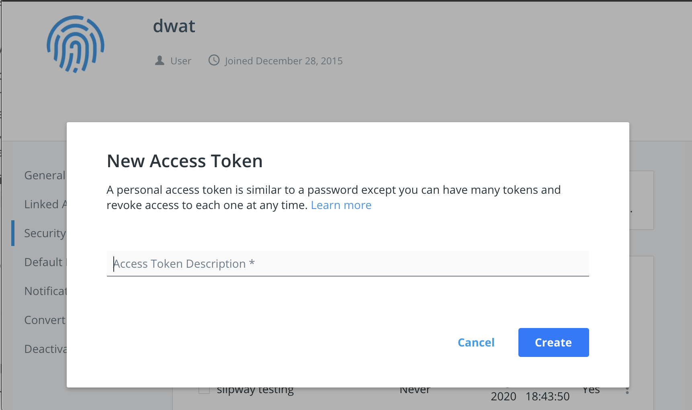
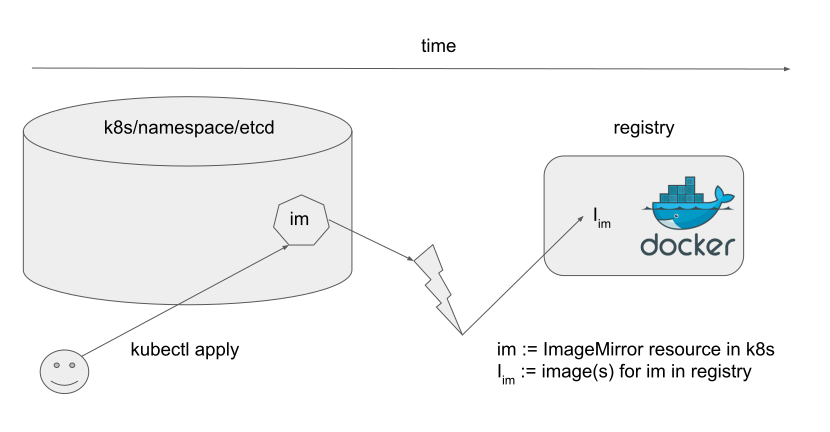

# slipway

> A slipway is a large platform that slopes down into the sea, from which boats
> are put into the water.

Slipway is a [k8s operator](https://kubernetes.io/docs/concepts/extend-kubernetes/operator/)
which securely mirrors container images between registries.
Users interact with the service by deploying k8s resources describing the
containers which should be mirrored, and the operator observes changes to these
resources and takes action.

# tl;dr

```bash
cat << EOF > imagemirror.yaml
apiVersion: slipway.k8s.facebook.com/v1
kind: ImageMirror
metadata:
  name: centos
spec:
  sourceRepo: docker.io
  destRepo: dtr.thefacebook.com/dwat
  imageName: centos
  pattern: "semver: ~7"
EOF

kubectl apply -f imagemirror.yaml
```

# Securely Mirroring Images

If no credentials are provided, slipway uses an anonymous identity when
authenticating. In most environments this is insecure, and might result in a
malicious image being mirrored and run. To prevent this is it possible to
specify basic auth credentials on a per registry basis.

In addition to the fields specified above, there are two fields for this
purpose, `sourceSecretName` and `destSecretName`. These names refer to
Kubernetes `Secret`s within the same namespace as the `ImageMirror` resource,
for example:

```
  sourceSecretName: docker-registry-creds
  destSecretName: dtr-registry-creds
```

To create these secrets, first obtain an access token from the registry. To
do this for Docker Trusted Registry, you may:

## Login to registry, and goto account settings



## Goto the security tab



## Click on "New Access Token"



## Copy token and create a k8s `Secret` with it

```bash
kubectl create secret generic docker-registry-token \
  --from-literal=username='dwat'
  --from-literal=password=<REACTED>
```

# Developer notes

## Architecture



Slipway enforces an [injection](https://mathworld.wolfram.com/Injection.html)
between k8s resources and image mirrors.
